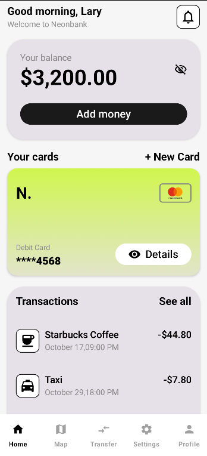
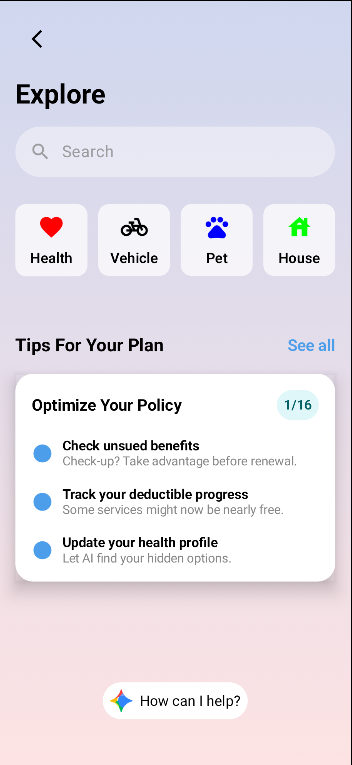
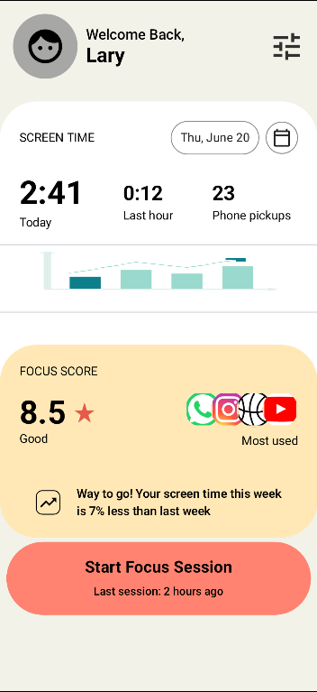
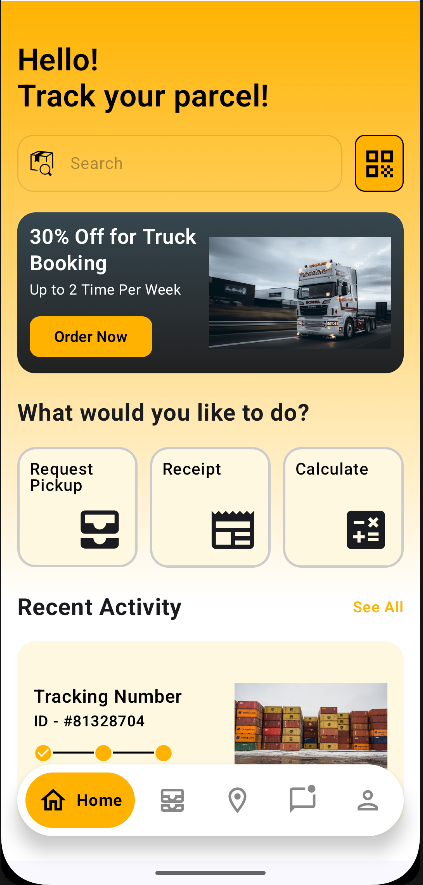

# Jetpack Compose UI Lab 🧪

This repository serves as a **personal laboratory** for demonstrating my progress in Android UI development using **Jetpack Compose**.

Instead of a single monolithic application, this project is structured as a collection of **standalone screens and UI challenges**.

## 📱 Project Structure

The app features a **Main Hub (Menu)** that allows navigation to different, unrelated UI implementations. Each screen is independent, focusing on specific UI/UX patterns.

## 🎨 Current Implementations

### 1. BankScreen
### 2. ScreenTime 
### 3. InsuranceScreen
### 4. TrackParcelScreen

## 🛠 Tech Stack
* **Language:** Kotlin
* **UI Toolkit:** Jetpack Compose (Material 3)
* **Navigation:** Type-safe Navigation Compose (to switch between the showcase screens)

## Screenshots

    
    
    
    
    

## 🔜 Upcoming Screens (Roadmap)

I plan to add more UI challenges

## 💡 Motivation

The purpose of this repository is to document my journey in mastering Declarative UI. It emphasizes clean code structure, reusability of composables, and the ability to translate Figma/Sketch designs into working code accurately.
